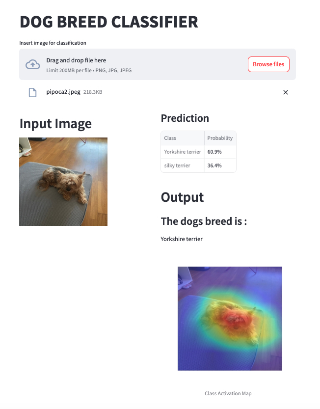

# Dog Breed Classifier



Dog_Breed_Classifier is a Convolutional Neural Network (CNN) application based on the VGG16 model for recognizing among 120 dog breeds. This project uses Streamlit for the web interface, Poetry for dependency management, and Docker to containerize the app.

The model has been trained utilizing the Stanford Dogs dataset. The dataset contains images of 120 breeds of dogs from around the world.

http://vision.stanford.edu/aditya86/ImageNetDogs/main.html

## Table of Contents

- [Installation](#installation)
- [Usage](#usage)
- [Development](#development)
- [Running Tests](#running-tests)
- [Docker](#docker)
- [License](#license)

## Installation

To install and set up the project, follow these steps:

1. **Clone the repository:**
    ```sh
    git clone https://github.com/brtenorio/Dog_Breed_Classifier
    cd Dog_Breed_Classifier
    ```

2. **Install Poetry (if not already installed):**
    ```sh
    pip install poetry==1.8.3 
    ```

3. **Set up the virtual environment and install dependencies:**
    ```sh
    make all
    ```

## Usage

To run the application, use:

    make run-app

## Development

To retrain the model, if needed, use:

    make retrain-model

Notice the trained model is already available in `saved_models/model.h5`. 

## Running Tests

To test the model, use:

    make test

## Docker

To containerize the application, use:

    make docker-build

followed by
    
    make docker-run-app

## API built with FastAPI

To run the API with docker, use

    make docker-run-api

